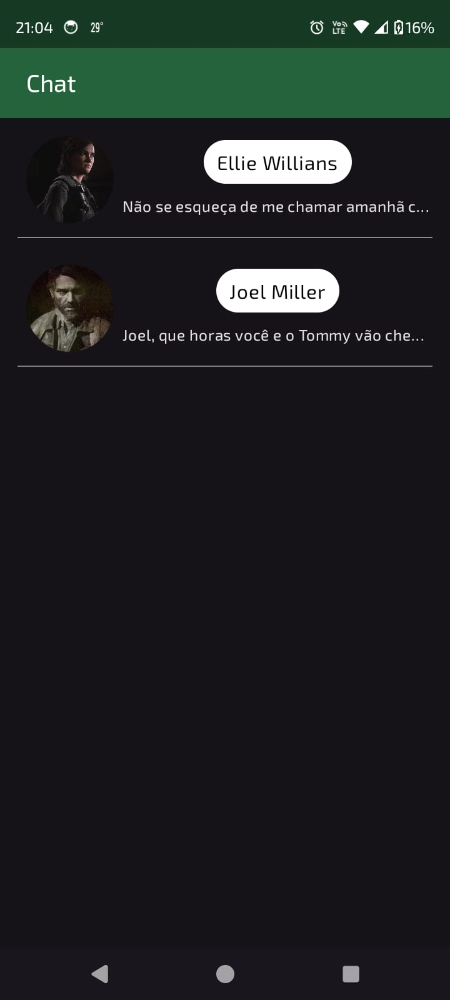

# Chat - Jetpack Compose

> Este projeto foi desenvolvido com o objetivo de melhorar meus conhecimentos em desenvolvimento
> Android utilizando o Jetpack Compose. A aplicação simula uma lista de conversas, permitindo
> entender como manipular listas no Jetpack Compose usando o `LazyColumn`.

## ⚙️ Tecnologias utilizadas

- **Kotlin**: Linguagem principal de desenvolvimento.
- **JDK 21**: Versão do Java usada no desenvolvimento.
- **Jetpack Compose**: Framework para construção de UI nativa.
- **JUnit**: Biblioteca de testes unitários.
- **Espresso**: Biblioteca de testes instrumentados.
- **ConstraintLayout**: Biblioteca para layouts complexos no Compose.

## 📚 Estrutura do Projeto

- `presentation`: Contém as telas, temas e componentes de UI.
- `model`: Contém as classes de modelo de dados, como `ChatViewData`.

## 📝 Funcionalidades principais

- Exibição de uma lista de conversas usando `LazyColumn`.
- Interface moderna e responsiva com Jetpack Compose.
- Testes instrumentados e unitários para garantir a qualidade do código.
- Pipeline de CI/CD configurado com GitHub Actions, garantindo que a cada novo push o código seja
  testado e validado automaticamente.
- Uso do Kotlin 2.0.10 e Java 21.

## ☕ Usando o Chat

Para usar o Chat, siga estas etapas:

1. Abra o Android Studio.
2. Selecione "Open an existing project" e escolha a pasta do projeto clonado.
3. Execute o projeto em um emulador ou dispositivo físico.

## 📫 Contribuindo para o Chat

Para contribuir com o Chat, siga estas etapas:

1. Bifurque este repositório.
2. Crie um branch: `git checkout -b <nome_branch>`.
3. Faça suas alterações e confirme-as: `git commit -m '<mensagem_commit>'`.
4. Envie para o branch original: `git push origin <nome_do_projeto>/<local>`.
5. Crie a solicitação de pull.

## 📸 Imagens do App

Aqui estão algumas capturas de tela do aplicativo:

    

## 📧 Contato

- **Nome**: Marcelo Souza
- **Email**: marcelocaregnatodesouza@gmail.com
- **LinkedIn**: [meu-linkedin](https://www.linkedin.com/in/marcelosouza-1999/)